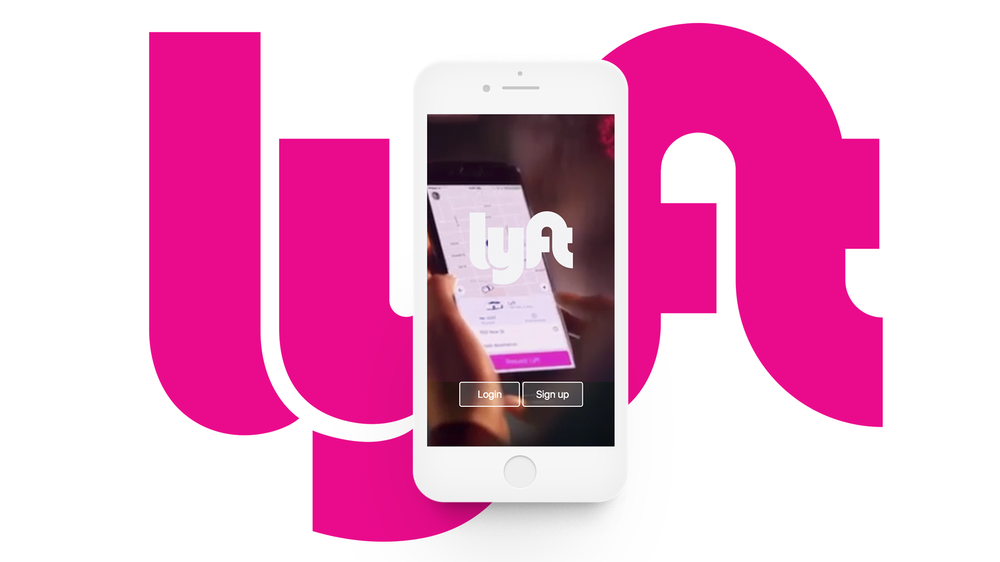
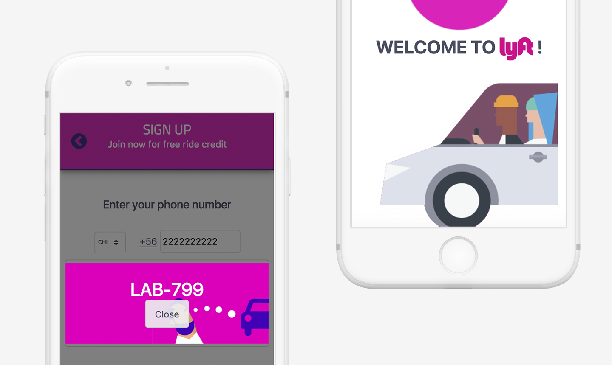

<h1>LYFT</h1>

Replicar la webapp de Lyft. Desarrollar el flujo del sign up del usuario.

<h3>REQUERIMIENTOS</h3>
* Vista splash de 2 a 5 segundos para la entrada.
* Pantalla de inicio con 2 opciones:
  - Sign up
  - Login
*Vista ingreso de número telefónico
*Envío y confirmación de código random.
*Formulario de información personal.
*Vista de registro exitoso.  

<h3>TOOLS</h3>
- Framework: Bootstrap v.4
- Librería: jquery

